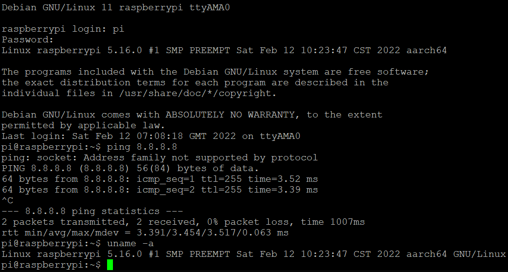

# Instructions of running Aarch64 Raspberry Pi image with Qemu


## Download & Configure ARM aarch64 toolchain

```
$ wget https://developer.arm.com/-/media/Files/downloads/gnu-a/10.3-2021.07/binrel/gcc-arm-10.3-2021.07-x86_64-aarch64-none-linux-gnu.tar.xz
$ tar xf gcc-arm-10.3-2021.07-x86_64-aarch64-none-linux-gnu.tar.xz
$ export PATH=$PATH:`pwd`/gcc-arm-10.3-2021.07-x86_64-aarch64-none-linux-gnu/bin
```


## Download & Cross-compile Linux kernel

```
$ git clone https://github.com/torvalds/linux.git
$ cd linux
$ git checkout -b v5.16 v5.16
$ ARCH=arm64 CROSS_COMPILE=aarch64-none-linux-gnu- make defconfig
$ ARCH=arm64 CROSS_COMPILE=aarch64-none-linux-gnu- make -j`nproc` Image
```

**Linux kernel binary can be found at arch/arm64/boot/Image*


## Download & Resize Raspberry PI image

```
$ wget https://downloads.raspberrypi.org/raspios_lite_arm64/images/raspios_lite_arm64-2022-01-28/2022-01-28-raspios-bullseye-arm64-lite.zip
$ unzip 2022-01-28-raspios-bullseye-arm64-lite.zip
$ qemu-img resize 2022-01-28-raspios-bullseye-arm64-lite.img +10G
$ parted 2022-01-28-raspios-bullseye-arm64-lite.img resizepart 2 100%
$ sudo losetup -f -P --show 2022-01-28-raspios-bullseye-arm64-lite.img
$ sudo e2fsck -f /dev/loop16p2
$ sudo resize2fs /dev/loop16p2
$ sudo losetup -d /dev/loop16
```

**Replace /dev/loopN with the one shows after losetup*


## Install Qemu emulator

```
$ sudo apt install qemu-system-arm
```


## Put it all together

```
$ qemu-system-aarch64 \
  -kernel linux/arch/arm64/boot/Image \
  -m 256 -M virt -cpu cortex-a53 \
  -append 'root=/dev/vda2 rw panic=1' \
  -drive "file=2022-01-28-raspios-bullseye-arm64-lite.img,if=none,index=0,media=disk,format=raw,id=disk0" \
  -device "virtio-blk-pci,drive=disk0,disable-modern=on,disable-legacy=off" \
  -device "virtio-net-pci,netdev=net0" \
  -netdev "user,id=net0,hostfwd=tcp::5022-:22" \
  -no-reboot -nographic
```

**qemu-system-aarch64 version 6.1.1*





## References

https://github.com/dhruvvyas90/qemu-rpi-kernel

https://azeria-labs.com/emulate-raspberry-pi-with-qemu/

